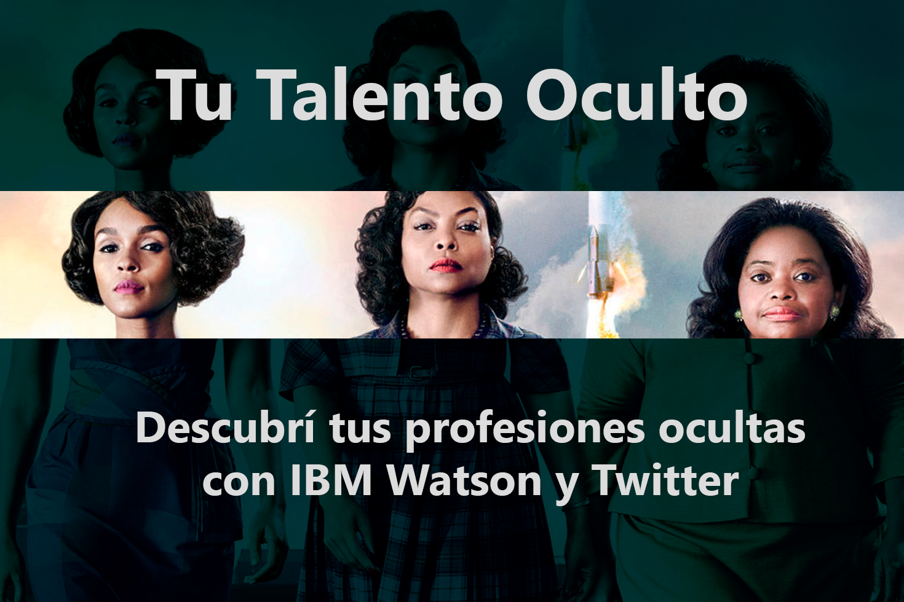

# Tu Talento Oculto

Basado en la película **`Hidden Figures`**.

## Instrucciones

1. `.env.example` > `.env`
2. Crear servicio [**`IBM Watson Personality Insights`**](https://cloud.ibm.com/catalog/services/personality-insights)
3. Crear una aplicación en [**`Twitter Developer`**](https://developer.twitter.com/en/apps/create)
4. Adjuntar credenciales de ambos a `.env`

## TODOs:

- [ ] Profundizar la documentación
